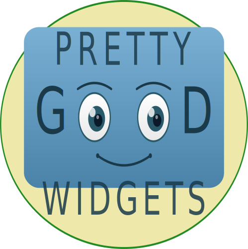

<p align="center">
  
</p>

<p align="center">
  A native JavaScript widget toolkit with Qt/GTK-style layout and controls.<br>
  No frameworks. No build step. No dependencies.
</p>

---

## What is PGWidgets?

pgwidgets is a pure JavaScript widget library that brings desktop-style UI
controls to the browser. If you've used Qt, GTK, or Tkinter, the API will
feel familiar: create widgets, pack them into layout containers, and wire
up callbacks.

```javascript
import { Widgets } from "./Widgets.js";

let top = new Widgets.TopLevel({title: "Hello", resizable: true});
top.resize(400, 300);

let vbox = new Widgets.VBox();
vbox.set_spacing(8);
vbox.set_padding(10);

let label = new Widgets.Label("Click the button!");
let button = new Widgets.Button("Click me");
button.add_callback('activated', () => label.set_text("Clicked!"));

vbox.add_widget(button, 0);
vbox.add_widget(label, 1);
top.set_widget(vbox);
top.show();
```

## Features

- **Zero dependencies** -- pure JavaScript ES modules, works directly in the browser
- **No build step** -- just include `Widgets.js` and `Widgets.css`
- **Desktop-style layouts** -- VBox, HBox, GridBox, Splitter, TabWidget, ScrollArea
- **MDI workspace** -- multiple draggable, resizable sub-windows with cascade/tile
- **Remote interface** -- drive the UI over WebSocket from Python or any language
- **Familiar API** -- callbacks, containers, and widget hierarchy inspired by Qt/GTK

## Widgets

### Layout & Containers

| Widget | Description |
|--------|-------------|
| **TopLevel** | Top-level window with optional title bar, dragging, and resize grips |
| **VBox / HBox** | Vertical and horizontal box layouts with spacing and stretch factors |
| **GridBox** | Grid layout with row/column placement |
| **Splitter** | Resizable split pane (horizontal or vertical) |
| **TabWidget** | Tabbed container with switchable pages |
| **StackWidget** | Stacked pages without tab headers |
| **ScrollArea** | Scrollable viewport with custom scrollbars |
| **Frame** | Titled border container |
| **Expander** | Collapsible section with a clickable header |
| **MDIWidget** | Multiple Document Interface workspace with sub-windows |

### Controls

| Widget | Description |
|--------|-------------|
| **Button** | Push button with optional icon |
| **ToggleButton** | Two-state button, supports exclusive groups |
| **CheckBox** | Checkbox with label |
| **RadioButton** | Radio button with exclusive group support |
| **ComboBox** | Dropdown with optional editable text, filtering, and scroll limit |
| **Slider** | Range slider (integer or float) |
| **SpinBox** | Numeric input with increment/decrement buttons |
| **Dial** | Rotary knob control |
| **ScrollBar** | Standalone scrollbar with draggable thumb |
| **ProgressBar** | Determinate progress indicator |

### Text & Display

| Widget | Description |
|--------|-------------|
| **Label** | Static text with alignment, color, and font options |
| **TextEntry** | Single-line text input with line history |
| **TextEntrySet** | Text entry with a submit button |
| **TextArea** | Multi-line text editor |
| **Image** | Image display widget |
| **Canvas** | HTML5 canvas for custom drawing |
| **TreeView** | Hierarchical tree/table with columns, sorting, icons, and multi-selection |

### Menus & Toolbars

| Widget | Description |
|--------|-------------|
| **MenuBar** | Horizontal menu bar |
| **Menu** | Dropdown menu with actions |
| **ToolBar** | Toolbar with buttons, toggles, and separators |

### Dialogs

| Widget | Description |
|--------|-------------|
| **Dialog** | Modal or non-modal dialog with configurable buttons |
| **ColorDialog** | Color picker with SV plane, hue strip, and RGB/HSV/hex inputs |

## Installation

### Standalone (no tooling)

Copy the repository and include it directly:

```html
<link rel="stylesheet" href="path/to/Widgets.css" />
<script type="module">
  import { Widgets } from "path/to/Widgets.js";
  // ...
</script>
```

### npm

```bash
npm install pgwidgets          # once published
# or install directly from GitHub:
npm install github:naojsoft/pgwidgets
```

Then in your bundled app:

```javascript
import { Widgets } from "pgwidgets";
import "pgwidgets/Widgets.css";
```

## Using from Python (Pyodide / PyScript)

pgwidgets can be used directly from Python in the browser via
[Pyodide](https://pyodide.org) or [PyScript](https://pyscript.net).
The `pgwidgets_js.pyodide` module provides Pythonic wrappers with
normal construction syntax, automatic type conversion, and callback
management.

```python
from pgwidgets_js.pyodide import Widgets

top = Widgets.TopLevel(title="Hello", resizable=True)
top.resize(400, 300)

vbox = Widgets.VBox(spacing=8, padding=10)

label = Widgets.Label("Click the button!")
button = Widgets.Button("Click me")
button.on("activated", lambda: label.set_text("Clicked!"))

vbox.add_widget(button, 0)
vbox.add_widget(label, 1)
top.set_widget(vbox)
top.show()
```

No WebSocket server needed -- everything runs in the browser. The same
Python code works with both Pyodide and PyScript; only the HTML loader
differs. See `examples/pyodide_demo.html` for a minimal Pyodide example,
`examples/all_widgets_pyodide.html` for a full demo via Pyodide, and
`examples/all_widgets_pyscript.html` for the same demo via PyScript.

## Remote Interface (WebSocket)

pgwidgets can also be controlled from a Python server over WebSocket
using the [pgwidgets-python](https://github.com/naojsoft/pgwidgets-python)
package. The browser page connects to the server, which sends JSON
messages to create widgets, call methods, and receive callbacks.

```python
from pgwidgets.sync import Application

app = Application()
app.start()
W = app.get_widgets()
app.wait_for_connection()

top = W.TopLevel(title="Remote App", resizable=True)
top.resize(400, 300)

vbox = W.VBox(spacing=8)
btn = W.Button("Click me")
status = W.Label("Ready")

btn.on("activated", lambda: status.set_text("Clicked!"))

vbox.add_widget(btn, 0)
vbox.add_widget(status, 1)
top.set_widget(vbox)
top.show()

app.run()
```

See `examples/remote_demo.py` and `examples/remote_demo_async.py`
for complete working examples.

## Building Desktop Apps with Electron

Because pgwidgets is just a browser library with no dependencies, it
runs unchanged inside an [Electron](https://electronjs.org) renderer
process. This lets you ship pgwidgets UIs as native desktop apps with
their own window chrome, system menus, and access to the file system.

A minimal example lives in `examples/electron/`:

```bash
cd examples/electron
npm install     # one-time, installs Electron locally
npm start       # launches the all_widgets demo in an Electron window
```

The Electron entry point (`main.js`) is about 20 lines and simply
creates a `BrowserWindow` that loads an HTML file -- no
Electron-specific changes are needed in pgwidgets itself. To use your
own UI, edit `main.js` to point at a different HTML file.

## Embedding Third-Party Libraries

The `ExternalWidget` class lets you embed content from third-party
JavaScript libraries -- Plotly charts, Bokeh plots, Leaflet maps, D3
visualizations, and more -- into pgwidgets layout containers. The
widget participates in pgwidgets layout (stretch factors, splitters,
tabs) while its content area is managed by the external library.

```javascript
let chart = new Widgets.ExternalWidget();
vbox.add_widget(chart, 1);  // stretch=1 fills available space

Plotly.newPlot(chart.get_content_element(), data, layout,
               {responsive: true});
```

See the [documentation](docs/external-widgets.rst) for full examples
with Plotly, Bokeh, and other libraries.

## Running the Examples

Start a local web server from the repository root:

```bash
python -m http.server --bind localhost 8000
```

Then open any example in your browser:

- [all_widgets.html](http://localhost:8000/examples/all_widgets.html) -- MDI workspace showcasing every widget (JavaScript)
- [all_widgets_pyodide.html](http://localhost:8000/examples/all_widgets_pyodide.html) -- Same demo, written entirely in Python via Pyodide
- [all_widgets_pyscript.html](http://localhost:8000/examples/all_widgets_pyscript.html) -- Same demo via PyScript
- [pyodide_demo.html](http://localhost:8000/examples/pyodide_demo.html) -- Minimal Pyodide example
- [treeview.html](http://localhost:8000/examples/treeview.html) -- TreeView with icons, sorting, and multi-selection
- [mdi_widget.html](http://localhost:8000/examples/mdi_widget.html) -- MDI with cascade/tile
- [dialog.html](http://localhost:8000/examples/dialog.html) -- Modal and non-modal dialogs
- [colordialog.html](http://localhost:8000/examples/colordialog.html) -- Color picker dialog
- [combobox.html](http://localhost:8000/examples/combobox.html) -- ComboBox variants
- [splitter.html](http://localhost:8000/examples/splitter.html) -- Resizable split panes
- [tab_widget.html](http://localhost:8000/examples/tab_widget.html) -- Tabbed interface
- [htmlview.html](http://localhost:8000/examples/htmlview.html) -- Rich HTML content display
- [videowidget.html](http://localhost:8000/examples/videowidget.html) -- Video playback with controls
- [external_widgets.html](http://localhost:8000/examples/external_widgets.html) -- Plotly and Bokeh in a splitter

And many more in the `examples/` directory.

## License

BSD 3-Clause
